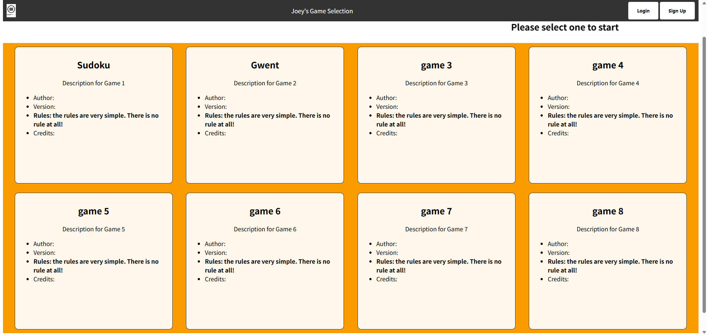

# CS5610-Project1
## File Structure
```
./
│  .gitignore
│  README.md
│  
├─images
│      drawer-icon.svg
│      md1.jpg
│      
├─javascript
│      index.js           # empty
│      
├─public
│      general.css
│      index.css
│      index.html
│      
└─src
    └─pages
        ├─account
        │      login.css
        │      login.html
        │      signup.html
        │      
        ├─games
        │      easy-game.html
        │      game.css
        │      hard-game.html
        │      
        ├─high-score
        │      high-score.css
        │      high-score.html
        │      
        └─sudoku
                sudoku.css
                sudoku.html
                
```
## Writeup
- Q: What was the most challenging piece of this assignment?  Did you find it easy or challenging to work with HTML and CSS?  How long did this overall assignment take you?
- A: I would say the most chanllenging and time consuming piece is designing. Without prior experience or expertise with web design makes me struggle. Working with HTML and CSS is generally easy, except that writing CSS is laborious, and sometimes tedious. A week approximately
- Q: What decisions did you make when you made your site mobile friendly?
- A: Adjust manually using @media.
- Q: What did you take into account when you developed the design of your website?  Is there anything that you’re particularly proud of?
- A: How it looks. No, the design is hideous. If there has to be one, I would say the game selection page is promising if given further improvement.
- Q: Given more time or resources, what additional features would you add to your site in the future? 
- A: A better design. Better arranged class names and ids for Javascripts. And maybe a new layout.
- Q: How many hours did you spend on this assignment?
- A: I lost count of it.
- Q: If you made any assumptions about this assignment, what are they?
- A: Can I say that users have a penchant for underdesigned websites?
## About
### I have put rules and credits into the index page, because it seems more concise.  
